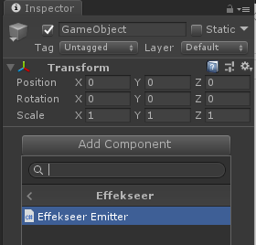
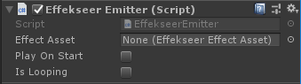
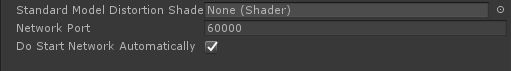

# 使い方

## サンプルプロジェクト {#example_program}

下記の場所にEffekseerプラグインを使用したサンプルプロジェクトがあります。

- GameEngine/Unity/SampleProject.zip


## リソースファイルについて {#resource_files}

Unityのプロジェクトに出力済エフェクト(*.efk)やテクスチャ、サウンドを配置します。  
\*.efkファイルをインポートすると、.efkファイルのほかにEffectAssetが生成されます。 


## エミッタを使って再生する方法 {#emitter_playback}

### 準備

エフェクトのエミッタコンポーネントをGameObjectにAddすることで、  
GameObjectに連動したエフェクトの再生を行うことができます。  

GameObjectに対してEffekseerEmitterを追加します。



### インスペクタのプロパティ

- Effect Asset: 先ほどインポートしたエフェクトアセットを指定します。
- Play On Start: チェックを入れると、シーン開始時(Start()のタイミング)に自動的に再生します。
- Loop: 再生終了したら自動的に再生をリクエストします。



### プレビュー

ゲームビューとシーンビューの話

EffekseerEmitterコンポーネントを設定するとシーンビューにプレビュー用のコントローラーが表示されます。
プレイを押さなくともシーンビューから操作してエフェクトをゲームビューでプレビューできます。


### 特徴

設置するエフェクトやキャラクターに追従するようなエフェクトに適しています。

## スクリプトから直接再生する方法 {#direct_playback}

### スクリプト

EffekseerSystem.PlayEffect()を使うことで、スクリプトからエフェクトを再生することができます。  

以下サンプルコードです。

```cs
void Start()
{
    // エフェクトを取得する。
    EffekseerEffectAsset effect = Resources.Load<EffekseerEffectAsset> ("Laser01");
    // transformの位置でエフェクトを再生する
    EffekseerHandle handle = EffekseerSystem.PlayEffect(effect, transform.position);
    // transformの回転を設定する。
    handle.SetRotation(transform.rotation);
}
```

### 特徴

PlayEffect()で再生した場合は自動で位置回転は変わりません。  
もし動かしたいときは手動で設定してやる必要があります。  

ヒットエフェクトや爆発エフェクトなど、シンプルに使いたいときに適しています。


## ネットワーク機能

ネットワーク経由でUnityで再生しているエフェクトを外部からアプリケーションの起動中に編集することができます。

Effekseer SettingsにEffekseerから接続するためのポートを指定します。DoStartNetworkAutomaticallyをOnにするか、EffekseerSystemのStartNetworkを実行します。
そうすると、Effekseerからエフェクトを編集できるようになります。他のコンピューターからエフェクトを編集するためにはファイヤーウォールの設定でポート開放する必要があります。


