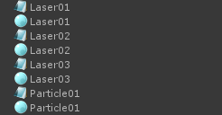
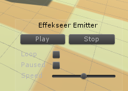
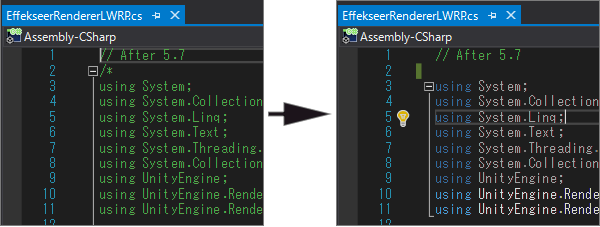
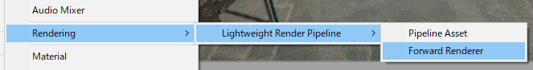
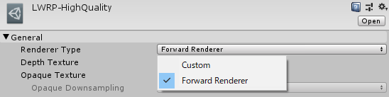
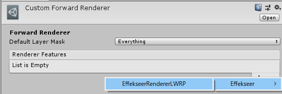
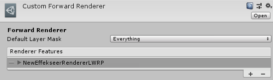

# How to use

## Sample Project

There is a sample project using the Effekseer plugin in the following places.

- GameEngine/Unity/SampleProject.zip


## About resource files

Place the output effect projcet(*.efkproj), effect (*.efk), texture, sound in Unity project.  
When importing the *.efk, efkproj file, EffectAsset is generated in addition of *.efk, efkproj file.



It is no problem that you remove .efk, efkproj files.
Please don't include .efk, efkproj in custom packages currently. 

## Play by Emitter

### Introduction

Add EffekseerEmitter to GameObject.  
In that case will play the effect linked to GameObject.


### Properties

- Effect Asset: Specifies the effect asset which is imported
- Play On Start: Plays on Start() when it is checked.
- IsLooping: When playback ends, it will automatically request playback.


### Preview

A controller for preview is shown in Scene View when EffekseerEmitter is specified. Effects can be previewed in Game View without playing.



### Note

It is suitable for effects that follow the installed effects and characters.

## Play by Script {#direct_playback}

### Introduction

Using EffekseerSystem.PlayEffect(), you can play effects from scripts.

The sample code is as follows.

```
void Start()
{
    // get an effect
    EffekseerEffectAsset effect = Resources.Load<EffekseerEffectAsset> ("Laser01");
    // Plays effect in transform.position
    EffekseerHandle handle = EffekseerSystem.PlayEffect(effect, transform.position);
    // Sets the rotation of the effect
    handle.SetRotation(transform.rotation);
}
```

### Note

When playing with PlayEffect(), the position rotation does not change automatically.
If you want to move it you need to set it manually.

Suitable for simple use, such as hit effects and explosion effects.

## Light Weight Render Pipeline

Effekseer supports LightWeightRenderPipeline.
Please remove comment out from *ScriptsExternal/EffekseerRendererLWRP.cs* because LWRP is not contained in Unity with default settings at first.



*Custom Forward Render* is used to show effects of Effekseer.

Create *Forward Render Asset* from *Assets -> Create -> Rendering -> Lightweight Render Pipeline -> Forward Render*.




Change *Renderer Type* into *Custom* in *Pipeline Asset* which is used to render. Specify created *Forward Render Asset* to *Data*.




Add EffekseerRenderer to *Render Features* in created *Forward Render Asset*.





Add * Effekseer/Effekseer RendererLWRP * component to GameObject with Camera in old LWRP.

## High Definition Render Pipeline

I will support it.

## Mobile environment

Disabling distortion from EffekseerSettings speeds up.

## Network
You can edit the playing effect in Unity via the network from the outside when application is running.


You specify the port to be connected from Effekseer fo Effekseer Setting. Make DoStartNetworkAutomatically On or execute StartNetwork in EffekseerSystem. Then you can edit the effect from Effekseer. In order to edit the effect from another computer, it is necessary to open the port with the setting of the firewall. 


