# How to use

## Sample Project

There is a sample scene using the Effekseer plugin in the following places.

- Example/EfkBasic
- Example/EfkTimeline


## About resource files

Place the output effect (*.efkproj, *.efk, *efkefc), texture, sound in Unity project.  
When importing the *.efk, efkproj, *efkefc file, EffectAsset is generated in addition of *.efk, efkproj, *efkefc file.


It is no problem that you remove .efk, efkproj, efkefc files.
Please don't include .efk, efkproj, efkefc in custom packages currently. 

### Scale

The loaded effect scale may be small. In that case, select EffectAssset and change the parameter of ** Scale **.
You can also change the effect scale by changing the Scale of EffectEmitter, but this method may not be enlarged depending on the effect settings.

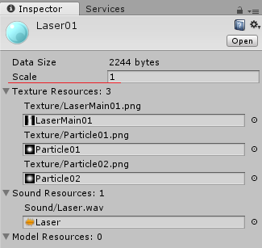

## Play by Emitter

### Introduction

Add EffekseerEmitter to GameObject.  
In that case will play the effect linked to GameObject.


### Properties

- Effect Asset: Specifies the effect asset which is imported
- Play On Start: Plays on Start() when it is checked.
- IsLooping: When playback ends, it will automatically request playback.


### Preview

A controller for preview is shown in Scene View when EffekseerEmitter is specified. Effects can be previewed in Game View without playing.


### Note

It is suitable for effects that follow the installed effects and characters.

## Play by Script

### Introduction

Using EffekseerSystem.PlayEffect(), you can play effects from scripts.

The sample code is as follows.

```
void Start()
{
    // get an effect
    EffekseerEffectAsset effect = Resources.Load<EffekseerEffectAsset> ("Laser01");
    // Plays effect in transform.position
    EffekseerHandle handle = EffekseerSystem.PlayEffect(effect, transform.position);
    // Sets the rotation of the effect
    handle.SetRotation(transform.rotation);
}
```

### Note

When playing with PlayEffect(), the position rotation does not change automatically.
If you want to move it you need to set it manually.

Suitable for simple use, such as hit effects and explosion effects.

## Universal Render Pipeline

Effekseer supports Universal RenderPipeline.

URPs are added differently for each version.
For older URPs, read the LWRP instructions.

Please remove comment out from *ScriptsExternal/EffekseerURPRenderPassFeature.cs* in the case of LWRP because URP is not contained in Unity with default settings at first.

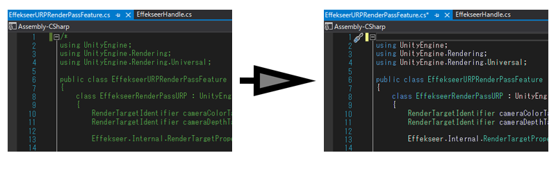

Look at Graphics Settings to see which ScriptableRenderPipelineSettings you are currently using.

If it already exists, select it.

If it does not exist, create it and select it.

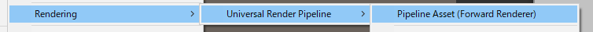

Select the ForwardRenderer used in the Pipeline.

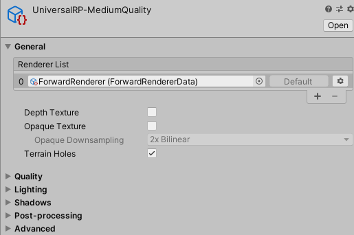

If ForwardRenderer is not used, create it, set it to Pipeline and select it.

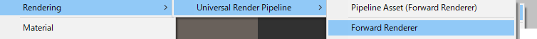

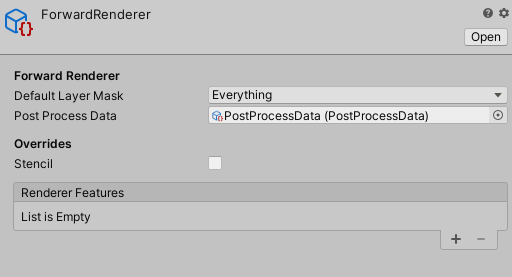

Add *EffekseerRenderPassFeature* to *Render Features* of *ForwardRenderer Asset* selected earlier.

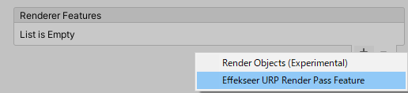

## High Definition Render Pipeline

Effekseer supports High Definition Render Pipeline.
Please remove comment out from *ScriptsExternal/EffekseerRendererHDRP.cs* because URP(LWRP) is not contained in Unity with default settings at first.


You add *CustomPassVolume* Component to a camera.

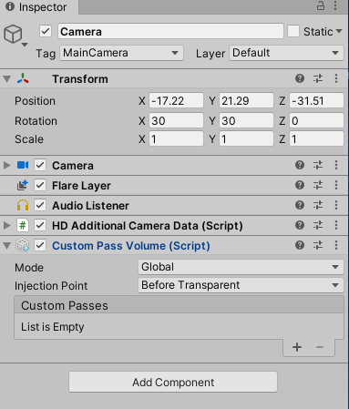

You add  *EffekseerRendererHDRP* to *CustomPasses*.


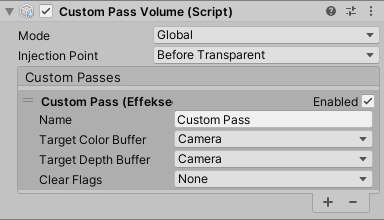

You change *Injection Point* into *Before Post Process*.

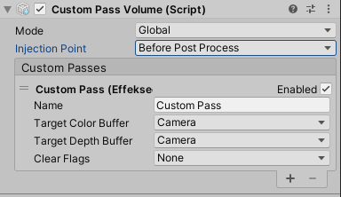

## PostProcessingStack (1.53 or later)

Effekseer can be drawn as a PostProcessingStack post-process.

Install PostProcessing and set the Post-Process Volume and Post-Process Layer.

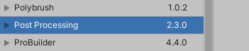

From EffekseerSettings, turn RenderAsPostProcessingStack On.

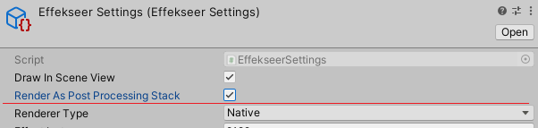

Add the effect to the Post-Processing Volume. BeforeStack and AfterStack exists, basically choose BeforeStack.
For more information, read the PostProcessingStack help.

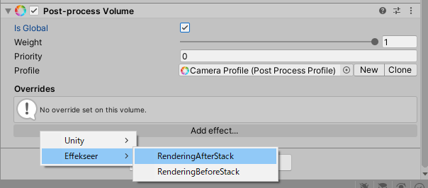

Enable the effect.

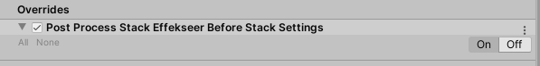

You can change the drawing order from CustomEffectSorting because effects are drawn as a post-process.


## Light Weight(Universal) Render Pipeline

Effekseer supports Universal(LightWeight)RenderPipeline.
Please remove comment out from *ScriptsExternal/EffekseerURPRenderPassFeature.cs* in the case of URP, *ScriptsExternal/EffekseerRendererLWRP.cs* in the case of LWRP because URP(LWRP) is not contained in Unity with default settings at first.


*Custom Forward Render* is used to show effects of Effekseer.

*URP* Create *Forward Render Asset* from *Assets -> Create -> Rendering -> Universal Render Pipeline -> Forward Render*.

*LWRP* Create *Forward Render Asset* from *Assets -> Create -> Rendering -> Lightweight Render Pipeline -> Forward Render*.


Change *Renderer Type* into *Custom* in *Pipeline Asset* which is used to render. Specify created *Forward Render Asset* to *Data*.


Add EffekseerRenderer to *Render Features* in created *Forward Render Asset*.


## Mobile environment

Disabling distortion from EffekseerSettings speeds up.

## Network
You can edit the playing effect in Unity via the network from the outside when application is running.


You specify the port to be connected from Effekseer fo Effekseer Setting. Make DoStartNetworkAutomatically On or execute StartNetwork in EffekseerSystem. Then you can edit the effect from Effekseer. In order to edit the effect from another computer, it is necessary to open the port with the setting of the firewall. 


